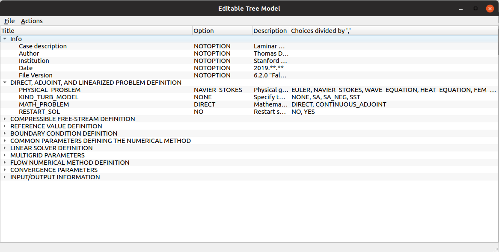

# SU2Configurer

This is an assistant tool for configuring the input file of SU2.

Framework: Qt Community Version (C++)

The configurer is not very intelligent now but you can edit the default.txt to make it more convenient for you. After your edit, you can click on the File menu and save your file in the standard SU2 configure format at the folder of this configurer executable. 

Some smarter functionalities would be added in the future as long as I have time.

Here are some expected ones:

1.  When user adds a module, the configurer can automatically fill the module item with its submodule options. For example, when you want unsteady function and add a line of **UNSTEADY SIMULATION**, you can see many sub items as the module's options.

 Anyone is welcome to create your issue to request for your functionality.